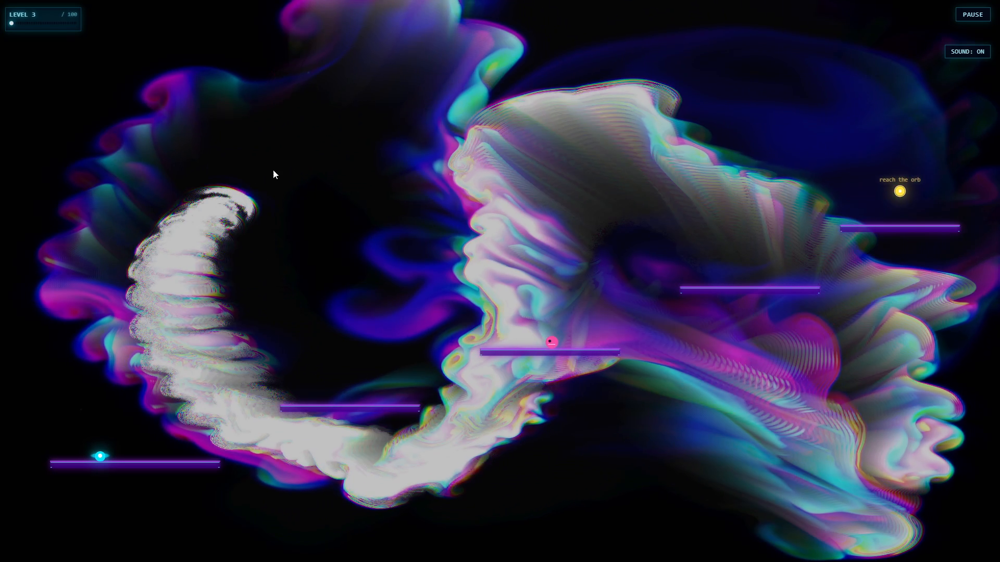

# Neon Fluid

A browser-based fluid platformer where a glowing liquid character navigates 100 levels driven by real incompressible fluid dynamics. The fluid is not decorative — it is the physics engine. Mouse strokes create pressure waves that lift the player, push boxes, and dissolve barriers.

**[Play it →](https://neonfluid.martincasais.com)**



---

## Fluid Simulation

The simulation is a direct implementation of Jos Stam's **"Real-Time Fluid Dynamics for Games"** (GDC 2003), which solves the incompressible Navier-Stokes equations using an unconditionally stable semi-Lagrangian scheme. The original paper made real-time fluid simulation practical by trading physical accuracy for guaranteed stability at any timestep.

Each frame runs three core steps:

1. **Diffusion** — viscosity spreads velocity across neighbouring cells, solved implicitly via Gauss-Seidel iteration to stay stable under large timesteps.
2. **Advection** — quantities (velocity, density) are transported along the current velocity field using a backwards particle trace and bilinear interpolation.
3. **Projection** — a pressure Poisson equation is solved to enforce incompressibility (∇·**u** = 0), then the pressure gradient is subtracted from velocity to make the field divergence-free.

On top of Stam's original formulation, the simulation adds **vorticity confinement** — a corrective force proportional to the curl of the velocity field that restores the small-scale rotational detail that numerical diffusion tends to dissipate.

### Dual-simulation architecture

The game runs two independent fluid simulations simultaneously:

| | CPU sim | GPU sim |
|---|---|---|
| **Grid** | 256 × 256 | 128–512 × 128–512 (tier-selected) |
| **Purpose** | Game physics | Visual rendering |
| **Solver** | TypeScript, Gauss-Seidel (12 iterations) | WebGL2 GLSL, Jacobi (15–40 iterations) |
| **Thread** | Web Worker (off main thread) | Main thread (GPU) |

The **CPU simulation** is the authoritative physics engine. Player buoyancy, box movement, barrier dissolution, and wind blowers all read from and write into this grid. It runs entirely inside a **Web Worker** using `SharedArrayBuffer` + `Atomics` for zero-copy communication. Each frame the main thread writes force inputs to shared memory and sends a `CMD_STEP` signal via `Atomics.notify`. The worker blocks on `Atomics.wait`, runs the full Stam step, writes velocity and density back to shared output buffers, and sets `CTRL_READY`. The main thread polls `CTRL_READY` non-blocking at the start of the next RAF — no `postMessage` copies in the hot path.

The **GPU simulation** runs entirely in WebGL2 shaders. Each step is a sequence of fullscreen fragment shader passes (advection, divergence, pressure solve, gradient subtraction, vorticity) ping-ponging between floating-point texture pairs. Its output is rendered directly to the background canvas. It receives the same force inputs as the CPU sim but has no effect on game state.

GPU resolution and Jacobi iteration count are chosen at startup by `detectGPUTier()`, which runs a warmup draw followed by a timed benchmark of 30 pressure iterations at N = 256 using `gl.finish()` for accurate GPU timing. The result selects one of three configs:

| Tier | Grid | Pressure iterations |
|------|------|-------------------|
| `high` | 512 × 512 | 40 |
| `medium` | 256 × 256 | 25 |
| `low` | 128 × 128 | 15 |

This separation means the visual fluid can run at high resolution without affecting gameplay determinism, and both simulations can be tuned independently.

---

## Gameplay

The player character is a fluid blob that responds to mouse-generated pressure. The core mechanic is dragging the mouse to create upward waves that carry the character across gaps no keyboard jump could reach.

- **10 handcrafted levels** that introduce mechanics progressively: moving platforms, pushable boxes, enemies, wind blowers, fluid barriers, pressure switches, and locked gates.
- **90 procedurally generated levels** (11–100) built with a seeded PRNG ([mulberry32](https://github.com/bryc/code/blob/master/jshash/PRNGs.md#mulberry32)), so each level index always produces the same layout. Difficulty scales continuously from level 10 onward by adjusting platform count, platform width, gap distance, and the probability of hazards, barriers, spikes, and switch/gate puzzles.

### Mechanics

| Element | Behaviour |
|---|---|
| **Mouse drag** | Injects velocity and density into both fluid grids. Creates pressure waves. |
| **Blowers** | Periodic upward bursts that generate lift — required in mid-game levels. |
| **Barriers** | Fluid-permeable walls that dissolve under sustained fluid pressure. |
| **Boxes** | Rigid bodies pushed by fluid momentum; can be stacked or used as steps. |
| **Switch / Gate** | Stepping on the switch opens the gate blocking the goal. |
| **Enemies** | Patrol platforms; contact resets the level. |
| **Spikes** | Static hazards; contact resets the level. |

---

## Audio

Sound effects and ambient layers are synthesized in real time with the Web Audio API. Level music first tries to play a looping audio asset (`theme.mp3`), and falls back to procedural synthesis if asset playback fails.

Procedural level music is derived from the level index: root frequency from an 8-note cycle, alternating major/minor tonality, tempo `60 + (levelIndex % 40)`, and arpeggiator step time cycling through four rhythmic patterns. Three layers run simultaneously: a bass oscillator with LFO modulation, a detuned chord pad, and a delay-fed arpeggiator. The menu has a separate ambient drone plus a shimmer layer.

Sound preference persists in `localStorage`.

---

## Tech stack

- **Next.js 16** (App Router, static export)
- **React 19** with `"use client"` game canvas
- **TypeScript** throughout — no `any`, strict mode
- **WebGL2** for GPU fluid rendering (no Three.js or external GL library)
- **Web Audio API** for procedural synthesis
- No game engine, no physics library, no canvas framework

---

## Project structure

```
lib/
  fluid.ts          # CPU Stam solver (256×256, TypeScript)
  fluid-gpu.ts      # GPU Stam solver (512×512, WebGL2 shaders)
  fluid-gl.ts       # WebGL2 renderer for the GPU simulation
  game/
    index.ts        # Game loop — wires fluid, input, audio, state
    layout.ts       # State initialisation and level loading
    levels.ts       # 10 handcrafted level definitions
    generate.ts     # Procedural level generator (levels 11–100)
    audio.ts        # Web Audio synthesis engine
    input.ts        # Keyboard input and menu navigation
    types.ts        # Shared type definitions
    update/         # Per-system update functions (player, boxes, enemies…)
    render/         # Per-system canvas 2D renderers
app/
  components/
    FluidGame.tsx   # React component — canvas setup, mouse handling, RAF loop
  layout.tsx        # Next.js root layout and metadata
  page.tsx          # Entry point
```

---

## Running locally

```bash
npm install
npm run dev
```

Open [http://localhost:3000](http://localhost:3000). Requires a desktop browser with WebGL2 support (Chrome, Firefox, Edge — all current versions).

```bash
npm run build   # production build
npm run lint    # ESLint
```

> The game requires a mouse and keyboard. Mobile and tablet devices are not supported.

---

## Reference

Jos Stam — *Real-Time Fluid Dynamics for Games*, GDC 2003.  
[http://graphics.cs.cmu.edu/nsp/course/15-464/Fall09/papers/StamFluidforGames.pdf](http://graphics.cs.cmu.edu/nsp/course/15-464/Fall09/papers/StamFluidforGames.pdf)
